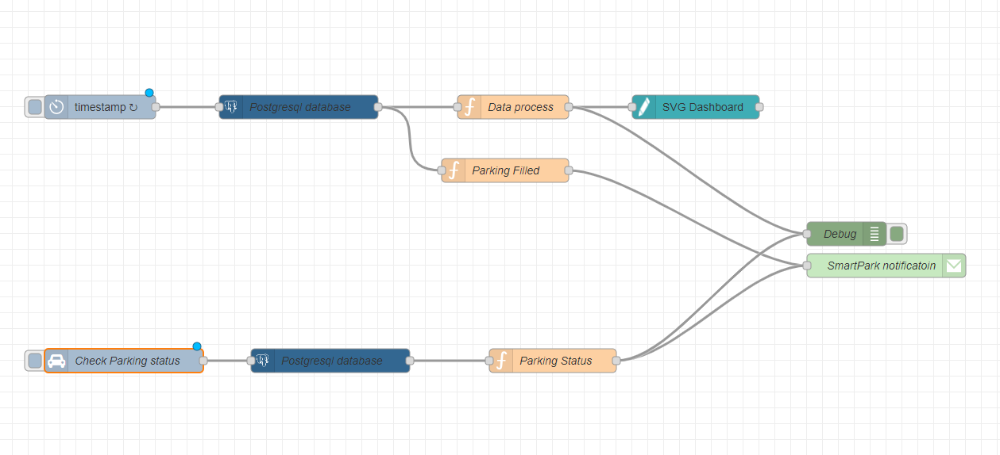
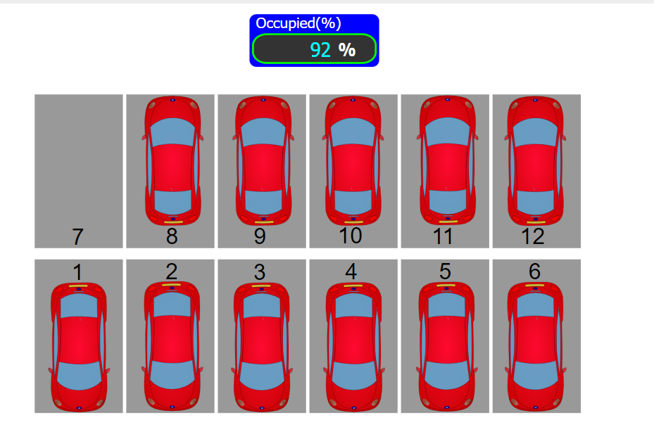

# SmartPark: AI-Driven AIoT Parking Solution for Apartment Communities

SmartPark redefines parking management in apartment communities through groundbreaking integration of Node-RED, PostgreSQL, and AI-driven OpenCV technology. This innovative solution delivers real-time updates on parking availability, using advanced object detection algorithms to enhance the resident experience.

## Table of Contents

- [Introduction](#introduction)
- [Congestion and Parking Problem](#congestion-and-parking-problem)
- [Functionalities and Benefits](#functionalities-and-benefits)
- [Methodology](#methodology)
- [Results](#results)
- [Conclusion](#conclusion)
- [Contributeurs](#contributeurs)

## Introduction

In urban living, managing parking within apartment communities is a persistent challenge. SmartPark emerges as a beacon of innovation, redefining parking standards by leveraging AI and IoT technologies. Through Node-RED, PostgreSQL, and OpenCV, SmartPark integrates systems for efficient parking management and real-time updates on availability.

## Congestion and Parking Problem

Urban populations are growing, and so is the demand for parking spaces. Traditional methods of parking management are inefficient, leading to frustration and traffic congestion. SmartPark addresses these issues with a dynamic approach to parking management, offering real-time visibility and reducing the time spent searching for parking.

## Functionalities and Benefits

### Real-Time Parking Availability
SmartPark provides continuous updates on parking availability, helping residents quickly find open spots. This reduces time spent searching for parking and alleviates congestion.

### Vehicle Detection and Tracking
AI-driven OpenCV technology accurately detects and tracks vehicles, providing precise data on parking occupancy.

### Intuitive Dashboard and Notifications
Residents have access to a user-friendly dashboard and receive instant notifications about parking availability, optimizing their daily routines.

### Efficiency and Convenience
SmartPark improves parking efficiency, reducing frustration and increasing resident satisfaction.

### Enhanced Security and Monitoring
Advanced object detection algorithms enhance security by monitoring vehicle movements and identifying unauthorized parking activities.

### Reduced Traffic Congestion
By guiding residents to available spaces, SmartPark reduces traffic congestion within communities.

### Scalability and Adaptability
SmartPark's architecture is scalable and adaptable to different parking facilities and community layouts, ensuring seamless integration and easy customization.

## Methodology

### System Architecture
Images from strategically positioned video cameras are processed using computer vision techniques to detect and analyze parking spaces.

### Object Detection
Vehicles are identified through object detection, focusing on areas with significant changes, using background subtraction to isolate foreground pixels.

### Contour Detection
Contour detection outlines the silhouette of each car, facilitating efficient parking lot management and enhancing security.

## Results

### Flow Node-RED
Illustrates the workflow of the Node-RED integration used in SmartPark.

### Dashboard
Provides an intuitive interface for users to view real-time parking data and receive notifications.

### Real-Time Parking Availability
Continuous updates ensure efficient use of parking facilities and reduce the time residents spend searching for parking.

### Vehicle Detection and Tracking
AI-driven algorithms accurately track vehicle movements, providing precise data on parking occupancy.

### Intuitive Dashboard and Notifications
Residents receive clear and concise information on parking availability and location.

### Efficiency and Convenience
SmartPark significantly improves parking efficiency and convenience within apartment communities.

### Enhanced Security and Monitoring
The system aids in identifying unauthorized parking activities, promoting a safer environment.

### Reduced Traffic Congestion
SmartPark helps alleviate traffic congestion within communities.

### Scalability and Adaptability
The solution is scalable and adaptable to different parking facilities and community layouts.

## Conclusion

SmartPark represents a transformative leap in parking management, offering a holistic solution that addresses existing challenges and paves the way for a more efficient, sustainable, and user-centric approach to urban parking.

## Contributeurs

   - [SABBAHI MOHAMED AMINE (Me)](https://github.com/amine-sabbahi).

   - [MAHRI AYMANE](https://github.com/AymaneM21).

   - [SALMA NIDAR](https://github.com/salma31nidar)

   - [BAKKALI AYOUB](https://github.com/BAKKALIAYOUB)

---

**Abdelmalek Essaadi University** Faculty of Sciences and Techniques
   - Department : Computer Engineering
   - Master : AI & DS
   - Module : IoT
   - Framed by : Pr. El Brak Mohammed